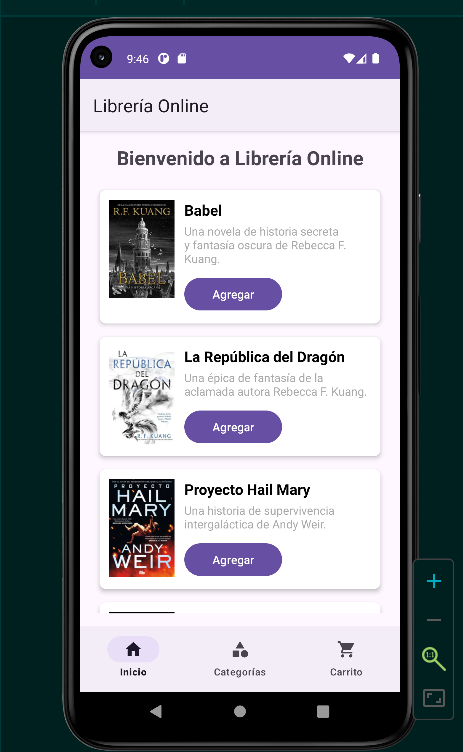
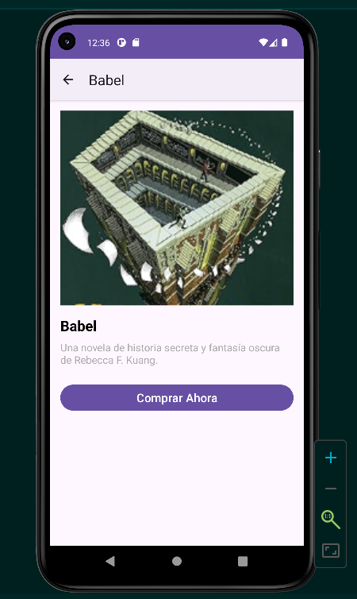
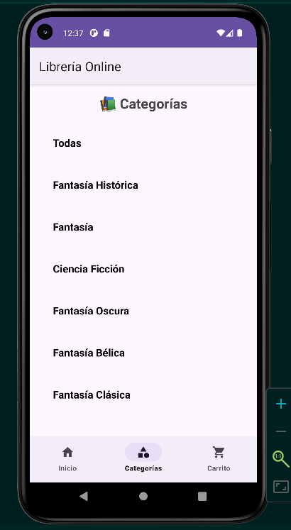
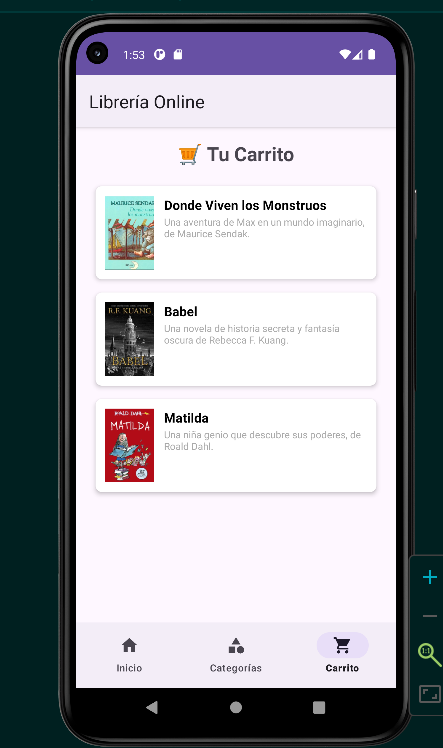

# 📚 App Librería Online - Evaluación Final

**Desarrollo de la Interfaz de Usuario Android**

Esta aplicación es una librería online que permite a los usuarios explorar libros, filtrarlos por categoría, ver detalles de cada libro y agregarlos a un carrito de compras.".

---

## 🎯 Funcionalidades Principales

1.  **Pantalla Principal (Inicio):**
    *   Muestra una lista de libros usando un `RecyclerView`.
    *   Cada libro se presenta en una tarjeta (`CardView`) con su portada (`ImageView`), título (`TextView`), descripción (`TextView`) y un botón para agregarlo al carrito (`Button`).
    *   Permite filtrar los libros por categoría (Fantasía, Ciencia Ficción, Infantil, etc.) desde la pestaña "Categorías".

2.  **Pantalla de Detalles:**
    *   Al hacer clic en un libro, se abre una nueva actividad (`DetalleLibroActivity`) que muestra la portada a mayor tamaño, el título, la descripción completa y un botón de "Comprar Ahora".
    *   Se implementa una barra de navegación superior con un botón "<" para regresar a la lista.

3.  **Carrito de Compras:**
    *   La pestaña "Carrito" muestra todos los libros que el usuario ha agregado.
    *   El carrito persiste mientras la app esté en memoria (implementado con un singleton `CarritoManager`).

4.  **Navegación:**
    *   Se utiliza un `BottomNavigationView` en la parte inferior para navegar entre las secciones principales: "Inicio", "Categorías" y "Carrito".
    *   La navegación a la pantalla de detalles se realiza mediante un `Intent`, pasando los datos del libro (título, descripción, imagen) como extras.

---

## 🚀 Cómo Ejecutar el Proyecto

1.  **Requisitos:**
    *   Tener instalado **Android Studio** (usamos la versión Narwhal).
    *   Tener configurado el **SDK de Android** (API 26 o superior).

2.  **Pasos:**
    1.  Clona este repositorio en tu máquina local:
        ```bash
        git clone https://github.com/N-Armijo/efm4.git
        ```
    2.  Abre Android Studio.
    3.  Selecciona **"Open an existing Android Studio project"**.
    4.  Navega hasta la carpeta del proyecto clonado y selecciónala.
    5.  Espera a que Android Studio sincronice los archivos Gradle.
    6.  Conecta un dispositivo físico o inicia un emulador.
    7.  Haz clic en el botón **"Run"** (▶️) en la barra de herramientas.

---

## 🛠️ Decisiones Clave de Desarrollo

*   **Arquitectura de Navegación:** Se optó por usar `Fragment` dentro de una `MainActivity` contenedora para gestionar las pestañas del `BottomNavigationView` ("Inicio", "Categorías", "Carrito"). Esto permite que la barra de navegación inferior permanezca visible y activa en todo momento, mejorando la experiencia de usuario. La pantalla de detalles, al ser un destino secundario, se implementó como una `Activity` separada, iniciada con un `Intent`, cumpliendo con el requerimiento específico de la evaluación.
*   **Gestión del Carrito:** Para permitir que el carrito sea accesible desde cualquier fragmento, se implementó una clase singleton `CarritoManager`. Esta clase actúa como un contenedor global y persistente (mientras dure la sesión de la app) para los libros agregados.
*   **Filtrado de Categorías:** El sistema de filtrado se diseñó para ser dinámico. Al seleccionar una categoría en el `CategoriasFragment`, se comunica con la `MainActivity`, que a su vez carga un nuevo `HomeFragment` pre-filtrado. Esto garantiza que el estado del filtro se mantenga incluso si el usuario navega a otras pestañas y regresa.
*   **Optimización de Assets:** Las imágenes de portada de los libros se colocaron en la carpeta `res/drawable-xxxhdpi` para garantizar una buena calidad en dispositivos de alta resolución. Se usaron formatos `.jpg` para optimizar el tamaño del APK.
*   **Convenciones de Código:** Se siguieron las buenas prácticas de nombrado, utilizando `snake_case` y prefijos semánticos para los IDs en los archivos XML (por ejemplo, `tv_titulo`, `btn_agregar`, `rv_libros`). Esto mejora la legibilidad y el mantenimiento del código.
*   **Manejo de Datos:** Los datos de los libros (título, descripción, categoría, imagen) se generan de forma estática en el código para este prototipo. En una app real, estos datos se obtendrían de una API o base de datos.

---

## 📸 Capturas de Pantalla

*Pantalla Principal*
<p align="center">
  
</p>
*Muestra la lista de libros en la pestaña "Inicio".*
<p align="center">
  
</p>
*Muestra la información completa de un libro.*
<p align="center">
  
</p>
*Permite al usuario filtrar los libros por género.*
<p align="center">
  
</p>
*Muestra los libros que el usuario ha agregado.*

---

## 📁 Estructura del Proyecto

*   `app/src/main/java/`: Contiene todos los archivos Java (actividades, fragmentos, adaptadores, modelo).
*   `app/src/main/res/layout/`: Archivos XML de diseño de las interfaces.
*   `app/src/main/res/drawable-xxxhdpi/`: Imágenes de alta resolución (portadas de libros).
*   `app/src/main/res/menu/`: Archivo XML para el menú del `BottomNavigationView`.

---